-   [Cel projektu](#cel-projektu)
-   [Przygotowanie danych](#przygotowanie-danych)
    -   [Wykorzystane biblioteki](#wykorzystane-biblioteki)
    -   [Zapewnienie powtarzalności](#zapewnienie-powtarzalności)
    -   [Ładowanie danych](#ładowanie-danych)
    -   [Interaktywny wykres długości śledzi w
        czasie](#interaktywny-wykres-długości-śledzi-w-czasie)
-   [Analiza atrybutów](#analiza-atrybutów)
    -   [Znaczenie atrybutów](#znaczenie-atrybutów)
    -   [Statystyki atrybutów](#statystyki-atrybutów)
    -   [Rozkłady atrybutów](#rozkłady-atrybutów)
    -   [Korelacje atrubutów](#korelacje-atrubutów)
-   [Regresja](#regresja)
    -   [Zbiory treningowy i testowy](#zbiory-treningowy-i-testowy)
    -   [Regresja liniowa](#regresja-liniowa)
    -   [Random forest](#random-forest)
-   [Podsumowanie](#podsumowanie)

Cel projektu
============

Celem projektu jest przygotowanie i analiza danych, a także zbudowanie
modelu w celu określenia przyczyn zmniejszającej się wielkości śledzi.

Przygotowanie danych
====================

Wykorzystane biblioteki
-----------------------

``` r
library(ggplot2)
library(plotly)
library(dplyr)
library(caret)
library(corrplot)
```

Zapewnienie powtarzalności
--------------------------

Powtarzalność uzyskana została poprzez ustawienie ziarna na stałą
wartość 1.

``` r
set.seed(1)
```

Ładowanie danych
----------------

Dane źródłowe są pobierane z adresu
“<a href="http://www.cs.put.poznan.pl/dbrzezinski/teaching/sphd/sledzie.csv" class="uri">http://www.cs.put.poznan.pl/dbrzezinski/teaching/sphd/sledzie.csv</a>”.  
Dodatkowo znak “?” jest automatycznie podmieniany na “NA”.

``` r
df <- read.csv("http://www.cs.put.poznan.pl/dbrzezinski/teaching/sphd/sledzie.csv", na = c("?", "NA"))
```

Wczytany zbiór ma 52582 wierszy.  
Z czego część wykazuje brakujące wartości.

    ##   X length   cfin1   cfin2   chel1    chel2   lcop1    lcop2  fbar   recr
    ## 1 0   23.0 0.02778 0.27785 2.46875       NA 2.54787 26.35881 0.356 482831
    ## 2 1   22.5 0.02778 0.27785 2.46875 21.43548 2.54787 26.35881 0.356 482831
    ## 3 2   25.0 0.02778 0.27785 2.46875 21.43548 2.54787 26.35881 0.356 482831
    ## 4 3   25.5 0.02778 0.27785 2.46875 21.43548 2.54787 26.35881 0.356 482831
    ## 5 4   24.0 0.02778 0.27785 2.46875 21.43548 2.54787 26.35881 0.356 482831
    ## 6 5   22.0 0.02778 0.27785 2.46875 21.43548 2.54787       NA 0.356 482831
    ##        cumf   totaln      sst      sal xmonth nao
    ## 1 0.3059879 267380.8 14.30693 35.51234      7 2.8
    ## 2 0.3059879 267380.8 14.30693 35.51234      7 2.8
    ## 3 0.3059879 267380.8 14.30693 35.51234      7 2.8
    ## 4 0.3059879 267380.8 14.30693 35.51234      7 2.8
    ## 5 0.3059879 267380.8 14.30693 35.51234      7 2.8
    ## 6 0.3059879 267380.8 14.30693 35.51234      7 2.8

W celu oczyszczenia zbioru wykonywane jest usunięcie wybrakowanych
wierszy.

``` r
df <- na.omit(df)
```

W efekcie zbiór maleje do 42488 wierszy.

    ##   X length   cfin1   cfin2   chel1    chel2   lcop1    lcop2  fbar   recr
    ## 2 1   22.5 0.02778 0.27785 2.46875 21.43548 2.54787 26.35881 0.356 482831
    ## 3 2   25.0 0.02778 0.27785 2.46875 21.43548 2.54787 26.35881 0.356 482831
    ## 4 3   25.5 0.02778 0.27785 2.46875 21.43548 2.54787 26.35881 0.356 482831
    ## 5 4   24.0 0.02778 0.27785 2.46875 21.43548 2.54787 26.35881 0.356 482831
    ## 7 6   24.0 0.02778 0.27785 2.46875 21.43548 2.54787 26.35881 0.356 482831
    ## 8 7   23.5 0.02778 0.27785 2.46875 21.43548 2.54787 26.35881 0.356 482831
    ##        cumf   totaln      sst      sal xmonth nao
    ## 2 0.3059879 267380.8 14.30693 35.51234      7 2.8
    ## 3 0.3059879 267380.8 14.30693 35.51234      7 2.8
    ## 4 0.3059879 267380.8 14.30693 35.51234      7 2.8
    ## 5 0.3059879 267380.8 14.30693 35.51234      7 2.8
    ## 7 0.3059879 267380.8 14.30693 35.51234      7 2.8
    ## 8 0.3059879 267380.8 14.30693 35.51234      7 2.8

Interaktywny wykres długości śledzi w czasie
--------------------------------------------

Poniższy wykres przedstawia zmiany w długości śledzi (lenght) w czasie,
w tym przypadku prezentowanym przez kolejne pomiary (X).  
Jest to możliwe, ponieważ pomiary były dodawane w porządku
chronologicznym.
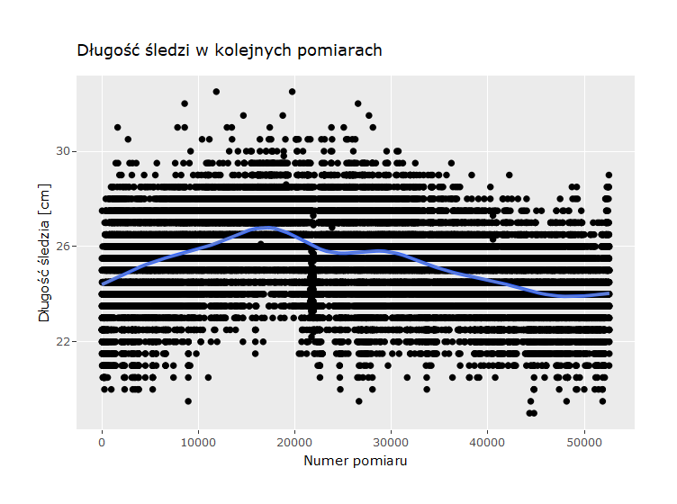

Analiza atrybutów
=================

Znaczenie atrybutów
-------------------

Znaczenie kolumn w pliku:  
-length: długość złowionego śledzia \[cm\];  
-cfin1: dostępność planktonu \[zagęszczenie Calanus finmarchicus gat.
1\];  
-cfin2: dostępność planktonu \[zagęszczenie Calanus finmarchicus gat.
2\];  
-chel1: dostępność planktonu \[zagęszczenie Calanus helgolandicus gat.
1\];  
-chel2: dostępność planktonu \[zagęszczenie Calanus helgolandicus gat.
2\];  
-lcop1: dostępność planktonu \[zagęszczenie widłonogów gat. 1\];  
-lcop2: dostępność planktonu \[zagęszczenie widłonogów gat. 2\];  
-fbar: natężenie połowów w regionie \[ułamek pozostawionego narybku\];  
-recr: roczny narybek \[liczba śledzi\];  
-cumf: łączne roczne natężenie połowów w regionie \[ułamek
pozostawionego narybku\];  
-totaln: łączna liczba ryb złowionych w ramach połowu \[liczba
śledzi\];  
-sst: temperatura przy powierzchni wody \[°C\];  
-sal: poziom zasolenia wody \[Knudsen ppt\];  
-xmonth: miesiąc połowu \[numer miesiąca\];  
-nao: oscylacja północnoatlantycka \[mb\].

Statystyki atrybutów
--------------------

    ##        X             length         cfin1             cfin2        
    ##  Min.   :    1   Min.   :19.0   Min.   : 0.0000   Min.   : 0.0000  
    ##  1st Qu.:13233   1st Qu.:24.0   1st Qu.: 0.0000   1st Qu.: 0.2778  
    ##  Median :26308   Median :25.5   Median : 0.1111   Median : 0.7012  
    ##  Mean   :26316   Mean   :25.3   Mean   : 0.4457   Mean   : 2.0269  
    ##  3rd Qu.:39447   3rd Qu.:26.5   3rd Qu.: 0.3333   3rd Qu.: 1.7936  
    ##  Max.   :52580   Max.   :32.5   Max.   :37.6667   Max.   :19.3958  
    ##      chel1            chel2            lcop1              lcop2       
    ##  Min.   : 0.000   Min.   : 5.238   Min.   :  0.3074   Min.   : 7.849  
    ##  1st Qu.: 2.469   1st Qu.:13.427   1st Qu.:  2.5479   1st Qu.:17.808  
    ##  Median : 5.750   Median :21.435   Median :  7.0000   Median :24.859  
    ##  Mean   :10.016   Mean   :21.197   Mean   : 12.8386   Mean   :28.396  
    ##  3rd Qu.:11.500   3rd Qu.:27.193   3rd Qu.: 21.2315   3rd Qu.:37.232  
    ##  Max.   :75.000   Max.   :57.706   Max.   :115.5833   Max.   :68.736  
    ##       fbar             recr              cumf             totaln       
    ##  Min.   :0.0680   Min.   : 140515   Min.   :0.06833   Min.   : 144137  
    ##  1st Qu.:0.2270   1st Qu.: 360061   1st Qu.:0.14809   1st Qu.: 306068  
    ##  Median :0.3320   Median : 421391   Median :0.23191   Median : 539558  
    ##  Mean   :0.3306   Mean   : 519877   Mean   :0.22987   Mean   : 515082  
    ##  3rd Qu.:0.4650   3rd Qu.: 724151   3rd Qu.:0.29803   3rd Qu.: 730351  
    ##  Max.   :0.8490   Max.   :1565890   Max.   :0.39801   Max.   :1015595  
    ##       sst             sal            xmonth            nao          
    ##  Min.   :12.77   Min.   :35.40   Min.   : 1.000   Min.   :-4.89000  
    ##  1st Qu.:13.60   1st Qu.:35.51   1st Qu.: 5.000   1st Qu.:-1.90000  
    ##  Median :13.86   Median :35.51   Median : 8.000   Median : 0.20000  
    ##  Mean   :13.87   Mean   :35.51   Mean   : 7.252   Mean   :-0.09642  
    ##  3rd Qu.:14.16   3rd Qu.:35.52   3rd Qu.: 9.000   3rd Qu.: 1.63000  
    ##  Max.   :14.73   Max.   :35.61   Max.   :12.000   Max.   : 5.08000

Rozkłady atrybutów
------------------

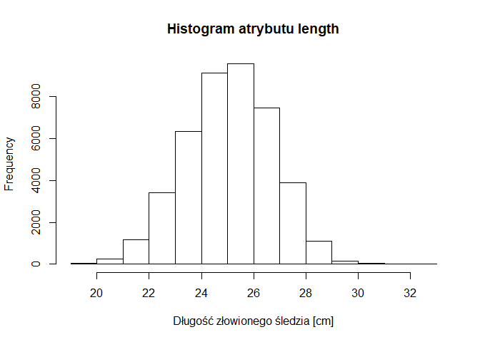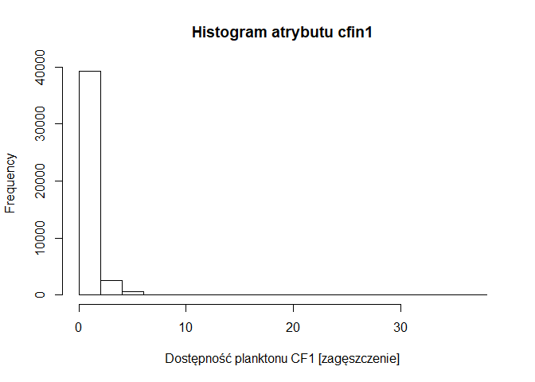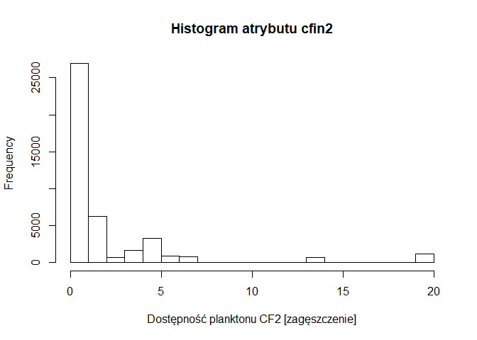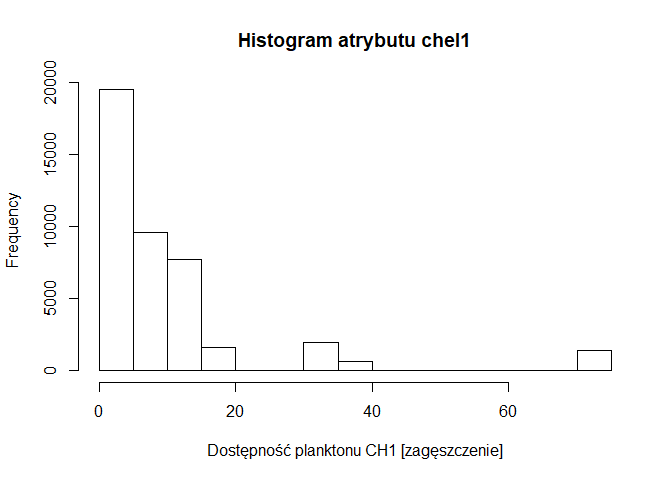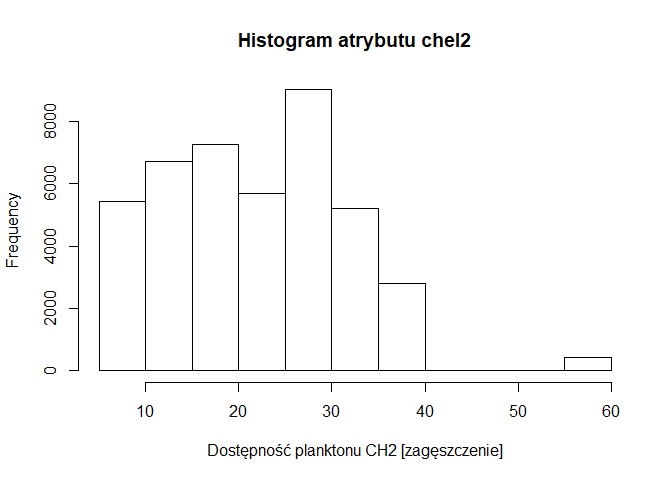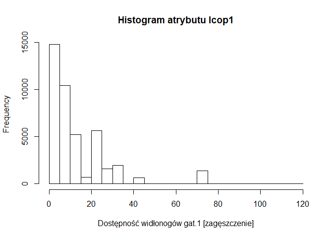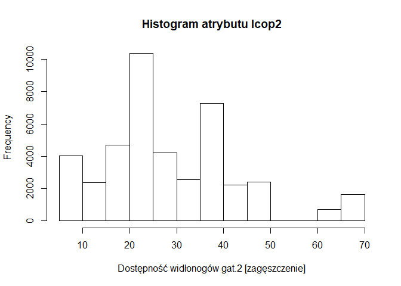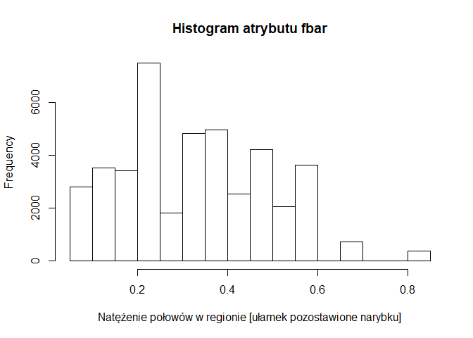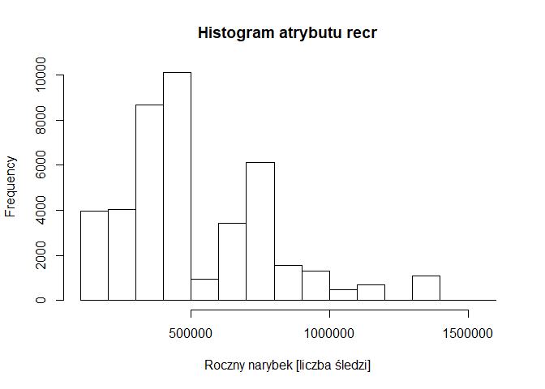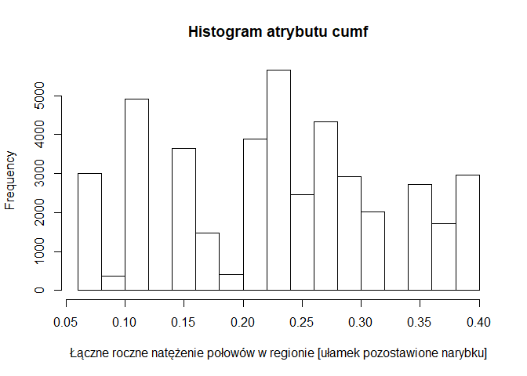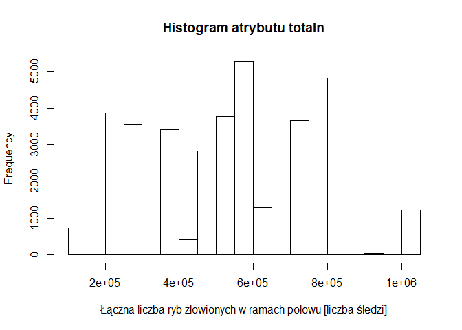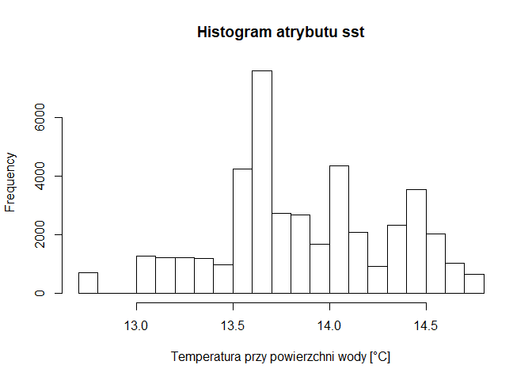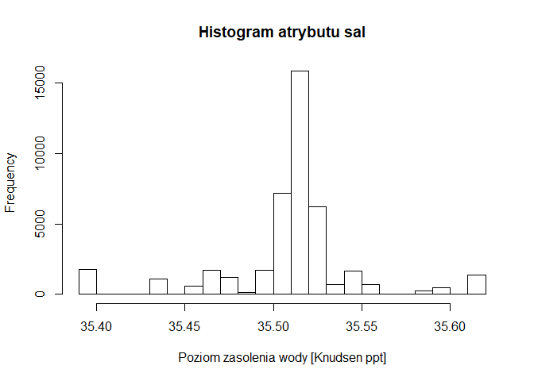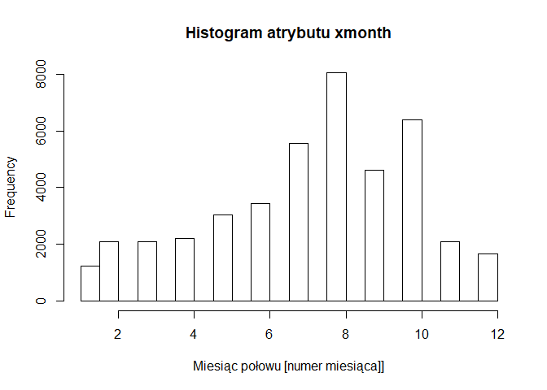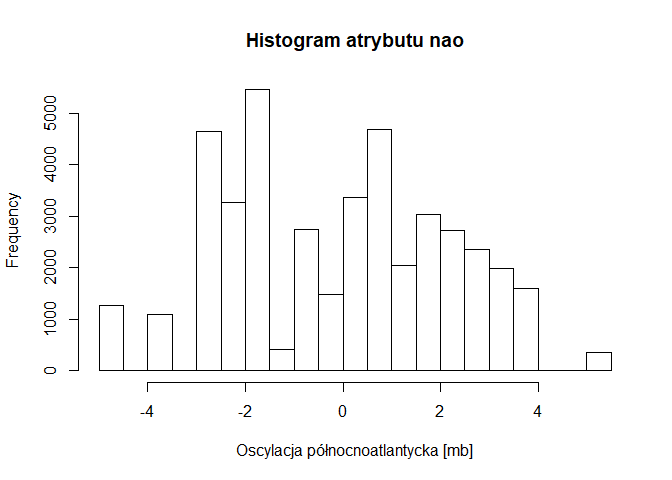

Korelacje atrubutów
-------------------

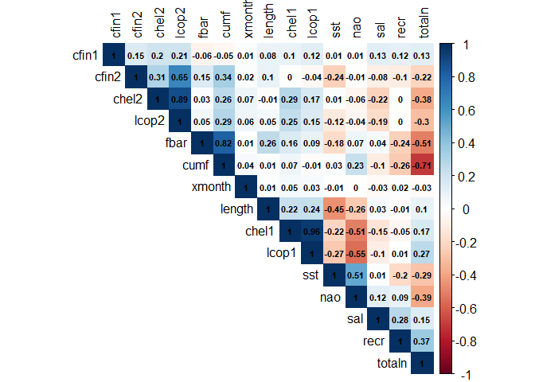

Na podstawie powyższego wykresu korelacji można dojść do następujących
wniosków:  
1 Atrybuty odpowiadające za liczebność planktonu i widłogonów są dość
mocno między sobą skorelowane  
1.1 chel1 z lcop1 - 0.96  
1.2 chel2 z lcop2 - 0.89  
1.3 cfin2 z lcop2 - 0.65  
2 Atrybuty związane z kwotami połowów są ze sobą mocno skorelowane  
2.1 cumf z totaln - -0.71  
2.2 cumf z fbar - 0.82  
2.3 fbar z totaln - -0.51  
W oparciu o te wnioski zapadła decyzja o usunięciu silnie skorelowanych
między sobą parametrów tak, żeby nie zakłócały dalszych opearcji na
danych. Usunięte zostały:  
- chel1 (mniejsza korelacja z lenght niż lcop1)  
- lcop2  
- cumf  
- totln


Bazując na nowym wykresie korelacji zostali wybrani kandydaci do
regresji:  
-lcop1  
-cfin1  
-chel2  
-sst  
-nao  
-fbar

Regresja
========

Zbiory treningowy i testowy
---------------------------

Zakres danych został podzielony na zbiór treningowy (20%) i testowy
(80%).  
Do trenowania została użyta 5-krotna walidacja krzyżowa.

``` r
in_training <- createDataPartition(y=df$length, p=0.8, list = FALSE)
in_test <- -in_training

train_set <- df[in_training,]
test_set <- df[-in_training,]

tc <- trainControl(method='repeatedcv', number=2, repeats=5)
```

Regresja liniowa
----------------

Pierwsze podejście polegało na wyuczeniu modelu przy użyciu wszystkich
atrybutów.

``` r
linear_regresion <- train(length ~ ., data=train_set, method="lm", preProcess = c('scale', 'center'), trControl=tc)
```

Wyniki nie były szczególnie dobre. Należy jednak wziąć pod uwagę poziom
skomplikowania zagadnienia.

``` r
predicted <- predict(linear_regresion, train_set)
postResample(predicted, df[in_training, 2])
```

    ##      RMSE  Rsquared       MAE 
    ## 1.3254250 0.3562385 1.0461212

Jako najważniejsze atrybuty zostały wskazane kwoty połowów co miałoby
pokrycie w rzeczywistości.

``` r
varImp(linear_regresion)
```

    ## lm variable importance
    ## 
    ##         Overall
    ## fbar   100.0000
    ## cumf    88.2750
    ## sst     69.9189
    ## X       68.2796
    ## totaln  23.2757
    ## nao     18.3867
    ## cfin1   17.0923
    ## lcop1   11.8064
    ## cfin2    9.3383
    ## sal      6.2191
    ## xmonth   5.3018
    ## recr     4.8373
    ## lcop2    3.4093
    ## chel2    0.6343
    ## chel1    0.0000

Drugie podejśćie do regresji liniowej obejmowało użycie atrybutów
wytypowanych przy sprawdzaniu korelacji.

``` r
linear_regresion <- train(length ~ lcop1 + cfin1 + chel2 + sst + nao + fbar, data=train_set, method="lm", preProcess = c('scale', 'center'), trControl=tc)
```

Efekt był zaskakujący, okazało się że wyniki się pogorszyły.

``` r
predicted <- predict(linear_regresion, train_set)
postResample(predicted, df[in_training, 2])
```

    ##      RMSE  Rsquared       MAE 
    ## 1.4210935 0.2599469 1.1336969

Najważniejszym atrybutem okazała się temperatura wody przy powierzchni,
a za raz po niej ponownie kwota połowów.

``` r
varImp(linear_regresion)
```

    ## lm variable importance
    ## 
    ##       Overall
    ## sst    100.00
    ## fbar    55.09
    ## cfin1   27.34
    ## lcop1   22.13
    ## chel2   11.88
    ## nao      0.00

Random forest
-------------

Następnym algorytmem został Random Forest. Pierwsza próba ponownie
została wykonana przy użyciu wszystkich atrybutów.

``` r
random_forest <- train(length ~ ., data=train_set, method="rf", trControl=tc, ntree = 10)
```

Wynik był dużo lepszy niż w regresji liniowej.

``` r
predicted <- predict(random_forest, train_set)
postResample(predicted, df[in_training, 2])
```

    ##      RMSE  Rsquared       MAE 
    ## 0.9529125 0.6698601 0.7492131

Co interesujące Random Forest już przy pierwszej próbie wskazał
temperaturę wody za główny czynnik, kwoty połowów dopiero jako czwarty.

``` r
varImp(random_forest)
```

    ## rf variable importance
    ## 
    ##         Overall
    ## X      100.0000
    ## sst     79.2546
    ## totaln  17.0151
    ## xmonth  13.9296
    ## fbar    11.2544
    ## chel2    9.6926
    ## nao      7.6693
    ## cumf     5.6391
    ## cfin2    5.1255
    ## lcop1    4.7938
    ## recr     2.7907
    ## lcop2    2.6187
    ## cfin1    1.4595
    ## sal      0.9779
    ## chel1    0.0000

Tak samo jak przy regresji została wykonana druga próba. Ponownie
zostały użyte parametry o wysokiej korelacji.

``` r
random_forest2 <- train(length ~ lcop1 + cfin1 + chel2 + sst + nao + fbar, data=train_set, method="rf", trControl=tc, ntree = 10)
```

I ponownie okazało się, że spowodowały one gorsze wyniki.

``` r
predicted <- predict(random_forest2, train_set)
postResample(predicted, df[in_training, 2])
```

    ##      RMSE  Rsquared       MAE 
    ## 1.1846836 0.4856943 0.9369111

Bez zmian natomiast pozostała ważność temperatury wody.

``` r
varImp(random_forest2)
```

    ## rf variable importance
    ## 
    ##        Overall
    ## sst   100.0000
    ## fbar   19.5437
    ## lcop1  15.2904
    ## chel2  13.8589
    ## cfin1   0.6511
    ## nao     0.0000

Podsumowanie
============

W efekcie przprowadzonych powyżej działań doszedłem do wniosku, że na
zmniejszającą się długość śledzia największy wpływ ma temperatura wody
przy powierzchni (rosnąca wraz z coraz silniejszym efektem
cieplarnianym) i ilości wyławianych ryb (najprawdopodobnie zbyt duże by
pozwolić się odtworzyć populacji dorołych osobników).
